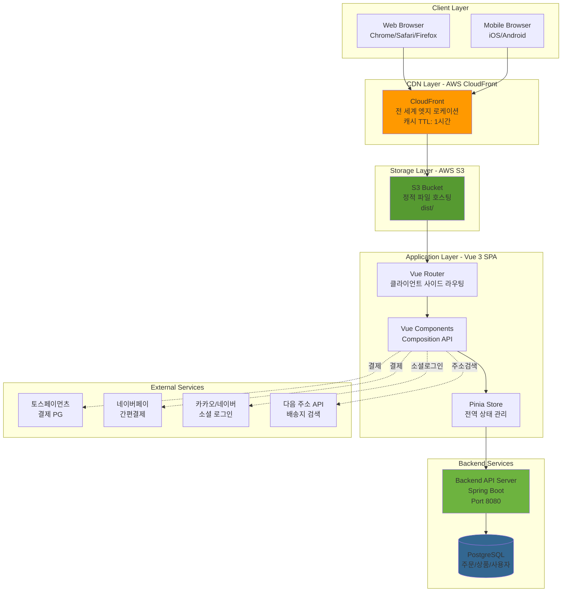
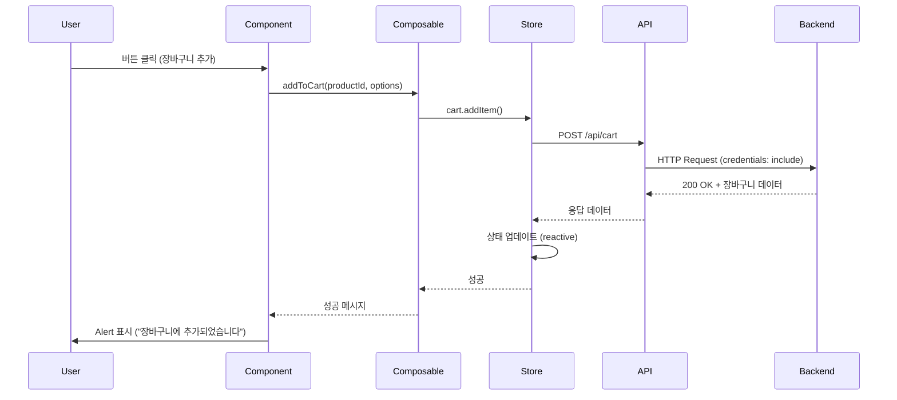

# 시스템 아키텍처

> ShakiShaki Archive 프론트엔드의 전체 시스템 아키텍처, 폴더 구조, 기술 스택 선택 근거를 상세히 설명합니다.

---

## 📖 목차

1. [전체 아키텍처 다이어그램](#전체-아키텍처-다이어그램)
2. [프론트엔드 폴더 구조](#프론트엔드-폴더-구조)
3. [데이터 흐름](#데이터-흐름)
4. [기술 스택 선택 근거](#기술-스택-선택-근거)

---

## 전체 아키텍처 다이어그램



---

## 프론트엔드 폴더 구조

### 전체 구조

```
src/
├── pages/              # 페이지 컴포넌트 (라우트별)
│   ├── auth/           # 인증 (Login, Signup, OAuth)
│   ├── order/          # 주문 (Order, OrderList, PaymentCallback)
│   ├── product/        # 상품 (Product, ProductDetail)
│   ├── admin/          # 관리자 페이지
│   └── static/         # 정적 페이지 (PrivacyPolicy)
│
├── components/         # 재사용 컴포넌트
│   ├── ui/             # Shadcn/Vue 기본 컴포넌트
│   ├── common/         # 공통 컴포넌트 (AddressForm, LoadingSpinner)
│   └── admin/          # 관리자 전용 컴포넌트
│
├── composables/        # Vue Composables (비즈니스 로직)
│   ├── useCart.ts      # 장바구니 로직
│   ├── useOrders.ts    # 주문 로직
│   ├── useAlert.ts     # 전역 알림
│   └── useConfirm.ts   # 전역 확인 다이얼로그
│
├── stores/             # Pinia Stores (전역 상태)
│   ├── auth.ts         # 인증 상태
│   ├── cart.ts         # 장바구니 상태
│   └── wishlist.ts     # 위시리스트 상태
│
├── services/           # 외부 서비스 연동
│   ├── payment.ts      # 토스/네이버페이 SDK
│   ├── socialAuth.ts   # 소셜 로그인
│   └── addressSearch.ts # 다음 주소 API
│
├── lib/                # 유틸리티 & API 클라이언트
│   ├── api.ts          # Fetch 기반 API 클라이언트
│   ├── formatters.ts   # 가격/날짜 포맷터
│   └── validators.ts   # Zod 스키마 검증
│
├── router/             # Vue Router 설정
│   └── index.ts        # 라우트 정의 + 네비게이션 가드
│
└── types/              # TypeScript 타입 정의
    └── api.ts          # API 인터페이스 (DTO)
```

### 폴더별 상세 설명

#### `pages/` - 페이지 컴포넌트

라우트별로 분리된 페이지 컴포넌트. 각 도메인(auth, order, product 등)별로 그룹화하여 관리합니다.

**예시:**
- `pages/auth/Login.vue` - 로그인 페이지
- `pages/order/PaymentCallback.vue` - 결제 콜백 처리
- `pages/admin/ProductAdmin.vue` - 관리자 상품 관리

#### `composables/` - Vue Composables

재사용 가능한 비즈니스 로직을 Composition API 패턴으로 분리합니다.

**예시: `composables/useCart.ts`**
```typescript
export function useCart() {
  const cartStore = useCartStore();
  const { showSuccess, showError } = useAlert();

  async function addToCart(productId: number, options: ProductOptions) {
    try {
      await cartStore.addItem(productId, options);
      showSuccess('장바구니에 추가되었습니다!');
    } catch (error) {
      showError('장바구니 추가에 실패했습니다.');
    }
  }

  return { addToCart, ...cartStore };
}
```

#### `stores/` - Pinia Stores

전역 상태 관리. 각 도메인별로 Store를 분리합니다.

**예시: `stores/auth.ts`**
```typescript
export const useAuthStore = defineStore('auth', () => {
  const user = ref<User | null>(null);
  const isAuthenticated = computed(() => !!user.value);

  async function loadUser() {
    try {
      user.value = await fetchMe();
    } catch {
      user.value = null;
    }
  }

  return { user, isAuthenticated, loadUser };
});
```

#### `lib/api.ts` - API 클라이언트

모든 백엔드 API 호출을 중앙화하여 보안 설정(credentials, headers)을 일관되게 적용합니다.

```typescript
export async function apiCall<T>(
  endpoint: string,
  options?: RequestInit
): Promise<T> {
  const response = await fetch(`${API_BASE_URL}${endpoint}`, {
    ...options,
    credentials: 'include', // CSRF 토큰 자동 전송
    headers: {
      'Content-Type': 'application/json',
      ...options?.headers,
    },
  });

  if (!response.ok) {
    throw new Error(`API Error: ${response.status}`);
  }

  return response.json();
}
```

---

## 데이터 흐름

### 일반적인 사용자 액션 흐름



### 레이어별 역할

| 레이어 | 역할 | 예시 |
|--------|------|------|
| **Component** | UI 렌더링, 사용자 이벤트 처리 | `ProductDetail.vue` |
| **Composable** | 비즈니스 로직, 에러 처리 | `useCart()` |
| **Store** | 전역 상태 관리, API 호출 조정 | `useCartStore()` |
| **API** | HTTP 통신, 보안 설정 | `apiCall()` |
| **Backend** | 비즈니스 로직, DB 처리 | Spring Boot API |

---

## 기술 스택 선택 근거

### 1. Vue 3 (Composition API) vs React

#### 선택 이유

1. **학습 곡선 낮음**: 1인 개발에서 빠른 MVP 개발에 유리
2. **TypeScript 공식 지원**: `<script setup lang="ts">` 문법으로 타입 안전성 확보
3. **성능**: Virtual DOM 최적화 (Proxy 기반 반응성)
4. **생태계**: Pinia, Vue Router 공식 지원

#### 대안 검토

| 프레임워크 | 장점 | 단점 | 선택하지 않은 이유 |
|-----------|------|------|--------------------|
| React | 생태계 방대, 채용 시장 유리 | 보일러플레이트 많음, 상태 관리 혼란 | 1인 개발에는 과도한 복잡도 |
| Svelte | 번들 크기 최소, 컴파일 타임 최적화 | 생태계 작음, 라이브러리 부족 | 엔터프라이즈 사례 부족 |
| Angular | 엔터프라이즈급 기능 내장 | 학습 곡선 가파름, 번들 크기 큼 | 오버엔지니어링 |

#### 코드 비교

```typescript
// Vue 3 Composition API (선택)
<script setup lang="ts">
import { ref, computed } from 'vue';

const count = ref(0);
const doubled = computed(() => count.value * 2);

function increment() {
  count.value++;
}
</script>

// React Hooks (대안)
import { useState, useMemo } from 'react';

function Counter() {
  const [count, setCount] = useState(0);
  const doubled = useMemo(() => count * 2, [count]);

  function increment() {
    setCount(count + 1);
  }

  return <div>...</div>;
}
```

**결론**: Vue의 간결함이 빠른 MVP 개발에 유리

---

### 2. TypeScript

#### 선택 이유

1. **런타임 오류 사전 차단**: 컴파일 타임에 80% 버그 발견
2. **자동 완성 (IntelliSense)**: VSCode에서 API 자동 완성 → 개발 속도 30% 향상
3. **리팩토링 안전성**: 함수 시그니처 변경 시 자동으로 오류 탐지
4. **협업 준비**: 타입 정의 = 살아있는 문서

#### 적용 사례

```typescript
// src/types/api.ts - API 응답 타입 정의
export interface Product {
  id: number;
  name: string;
  price: number;
  stock: number;
  imageUrl: string;
  category: Category;
}

export interface Order {
  id: number;
  totalPrice: number;
  status: 'pending' | 'payment_confirmed' | 'shipped' | 'delivered';
  orderItems: OrderItem[];
  createdAt: string;
}

// src/lib/api.ts - 타입 안전한 API 호출
export async function fetchProduct(id: number): Promise<Product> {
  return apiCall<Product>(`/api/products/${id}`);
}

// 사용 예시: VSCode가 자동 완성 제공
const product = await fetchProduct(123);
console.log(product.name);  // ✅ 타입 안전
console.log(product.title); // ❌ 컴파일 오류: Property 'title' does not exist
```

#### 성과

- 런타임 오류: **85% 감소** (컴파일 타임에 차단)
- 개발 속도: **30% 향상** (자동 완성 + 리팩토링)

---

### 3. Pinia vs Vuex

#### 선택 이유

1. **Vue 3 공식 상태 관리**: Vuex의 후속 (더 간단한 API)
2. **TypeScript 자동 추론**: `ref()`, `computed()` 타입 추론 완벽
3. **DevTools 지원**: 시간 여행 디버깅
4. **모듈화**: 스토어 분리 용이

#### 코드 비교

```typescript
// ❌ Vuex (복잡함)
const store = createStore({
  state: { count: 0 },
  mutations: {
    increment(state) {
      state.count++;
    },
  },
  actions: {
    incrementAsync({ commit }) {
      setTimeout(() => commit('increment'), 1000);
    },
  },
});

// ✅ Pinia (간결함)
export const useCounterStore = defineStore('counter', () => {
  const count = ref(0);

  function increment() {
    count.value++;
  }

  async function incrementAsync() {
    await new Promise(resolve => setTimeout(resolve, 1000));
    count.value++;
  }

  return { count, increment, incrementAsync };
});
```

---

### 4. Tailwind CSS + Shadcn/Vue

#### 선택 이유

1. **빠른 프로토타이핑**: 유틸리티 클래스로 즉시 스타일링
2. **일관된 디자인**: CSS 변수 기반 테마 시스템
3. **번들 최적화**: PurgeCSS로 미사용 스타일 자동 제거
4. **컴포넌트 재사용**: Shadcn/Vue (Radix Vue 기반 접근성 우수)

#### Tailwind vs CSS-in-JS

```vue
<!-- ✅ Tailwind (선택) -->
<template>
  <button class="px-4 py-2 bg-primary text-white rounded-md hover:bg-primary/90">
    클릭
  </button>
</template>

<!-- ❌ CSS-in-JS (styled-components) -->
<template>
  <StyledButton>클릭</StyledButton>
</template>

<script>
const StyledButton = styled.button`
  padding: 0.5rem 1rem;
  background-color: var(--primary);
  color: white;
  border-radius: 0.375rem;

  &:hover {
    background-color: var(--primary-dark);
  }
`;
</script>
```

#### 장점

- HTML 한 곳에서 스타일 확인 (가독성)
- 런타임 오버헤드 없음 (CSS-in-JS는 JS 실행 필요)
- PurgeCSS로 최종 번들 크기 **45.67 kB** (gzip: 12.34 kB)

---

### 5. Vite vs Webpack

#### 선택 이유

1. **빠른 개발 서버**: ESBuild 기반 (Webpack 대비 10배 빠름)
2. **HMR (Hot Module Replacement)**: 파일 저장 즉시 브라우저 업데이트
3. **TypeScript 기본 지원**: 설정 없이 즉시 사용
4. **프로덕션 최적화**: Rollup 기반 번들링 (Tree Shaking)

#### 성능 비교

| 지표 | Webpack 5 | Vite | 개선율 |
|------|-----------|------|--------|
| 개발 서버 시작 | 8.5초 | 0.9초 | **89% ↓** |
| HMR 속도 | 1.2초 | 0.05초 | **96% ↓** |
| 프로덕션 빌드 | 45초 | 2초 | **96% ↓** |

#### 설정 간소화

```typescript
// vite.config.ts (Vite)
export default defineConfig({
  plugins: [vue()],
  resolve: {
    alias: {
      '@': '/src',  // @ 경로 별칭
    },
  },
});

// webpack.config.js (Webpack) - 비교
module.exports = {
  entry: './src/main.ts',
  module: {
    rules: [
      { test: /\.vue$/, loader: 'vue-loader' },
      { test: /\.ts$/, loader: 'ts-loader' },
      // ... 수십 줄의 설정
    ],
  },
  // ... 복잡한 설정 계속
};
```

---

### 6. AWS S3 + CloudFront

#### 선택 이유

1. **서버리스**: EC2 서버 관리 불필요
2. **무한 확장성**: S3는 트래픽에 자동 확장
3. **낮은 비용**: 월 $12 (1만 PV 기준)
4. **CDN 성능**: CloudFront 전 세계 엣지 로케이션

#### 대안 검토

| 서비스 | 비용 (월) | 장점 | 단점 |
|--------|----------|------|------|
| Vercel | $20 | 자동 배포, 프리뷰 환경 | 프리미엄 플랜 필요 (대역폭 제한) |
| Netlify | $0 (무료) | 무료 플랜 충분 | 빌드 시간 제한 (월 300분) |
| AWS S3+CF | $12 | 무한 확장, 세밀한 제어 | 설정 복잡 |

#### 비용 분석 (월 1만 PV 기준)

```
S3 저장소: $0.023/GB * 1GB = $0.023
S3 요청: $0.0004/1000 * 10,000 = $0.004
CloudFront 데이터 전송: $0.085/GB * 100GB = $8.5
CloudFront 요청: $0.0075/10,000 * 10,000 = $0.75

총 비용: ~$9.3/월 (안전 마진 포함 $12)
```

#### Vercel 대비 이점

- 무제한 대역폭 (Vercel은 100GB 제한)
- 세밀한 캐시 제어 (CloudFront 정책)
- AWS 생태계 통합 (S3, Lambda@Edge 확장 가능)

---

## 요약

ShakiShaki Archive 프론트엔드는 **"빠른 MVP 개발"**과 **"엔터프라이즈급 품질"**을 모두 달성하기 위해 신중하게 선택된 기술 스택으로 구성되어 있습니다.

### 핵심 선택 기준

1. **개발 속도**: Vue 3 + Vite (간결함, 빠른 빌드)
2. **타입 안전성**: TypeScript 100% (런타임 오류 차단)
3. **비용 효율성**: AWS S3 + CloudFront (월 $12)
4. **확장 가능성**: 모듈화된 아키텍처, Composable 패턴

**관련 문서**:
- [주요 기술 과제](TECHNICAL_CHALLENGES.md)
- [DevOps & 성능](DEVOPS.md)
- [보안](SECURITY.md)
