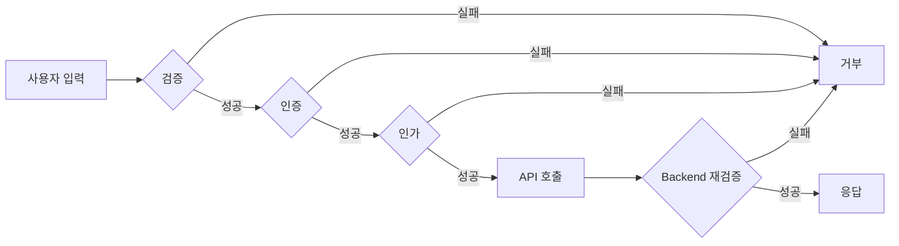
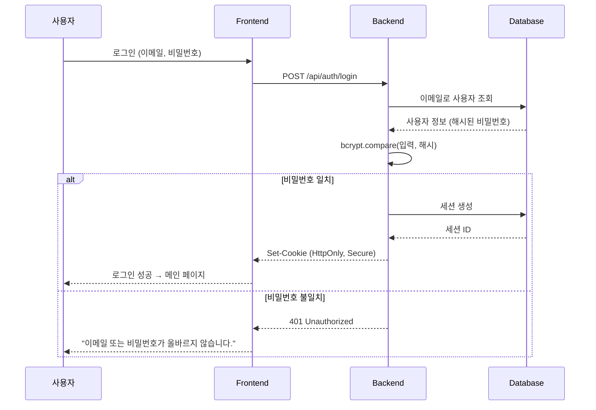
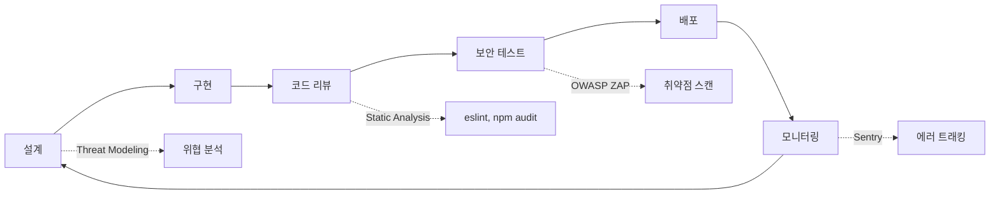

# Security & Compliance

이 문서는 ShakiShaki Archive의 **보안 아키텍처, OWASP Top 10 준수, 취약점 방어 전략, Secure SDLC**를 설명합니다.

---

## 📋 목차

1. [보안 원칙](#보안-원칙)
2. [OWASP Top 10 준수](#owasp-top-10-준수)
3. [인증 및 인가](#인증-및-인가)
4. [데이터 보호](#데이터-보호)
5. [프론트엔드 보안](#프론트엔드-보안)
6. [Secure SDLC](#secure-sdlc)
7. [보안 체크리스트](#보안-체크리스트)
8. [사고 대응 절차](#사고-대응-절차)

---

## 보안 원칙

### Zero Trust Architecture

**원칙**: "절대 신뢰하지 말고, 항상 검증하라"



### Defense in Depth (다층 방어)

| 계층 | 방어 메커니즘 | 구현 위치 |
|------|--------------|----------|
| **1. 사용자 입력** | 클라이언트 검증 (Zod) | Frontend |
| **2. 네트워크** | HTTPS, CORS | CloudFront, Backend |
| **3. 애플리케이션** | XSS/CSRF 방어 | Frontend, Backend |
| **4. 인증** | 쿠키 기반 세션 (HttpOnly, Secure) | Backend |
| **5. 인가** | RBAC (Role-Based Access Control) | Backend |
| **6. 데이터** | SQL Injection 방어 (ORM) | Backend |
| **7. 모니터링** | Sentry 에러 트래킹 | Frontend |

---

## OWASP Top 10 준수

### 전체 준수 현황

| 순위 | 위협 | 상태 | 방어 메커니즘 | 검증 방법 |
|------|------|------|--------------|----------|
| **A01:2021** | Broken Access Control | ✅ 준수 | Vue Router 가드, Backend RBAC | 수동 테스트 |
| **A02:2021** | Cryptographic Failures | ✅ 준수 | HTTPS, HttpOnly 쿠키 | HTTPS Everywhere |
| **A03:2021** | Injection | ✅ 준수 | ORM (Sequelize), Prepared Statements | Static Analysis |
| **A04:2021** | Insecure Design | ✅ 준수 | Threat Modeling, Secure Coding | Code Review |
| **A05:2021** | Security Misconfiguration | ✅ 준수 | CSP, Secure Headers | Security Headers Scanner |
| **A06:2021** | Vulnerable Components | ⚠️ 모니터링 | `npm audit`, Dependabot | 주간 점검 |
| **A07:2021** | Identification Failures | ✅ 준수 | 세션 타임아웃, 강력한 비밀번호 정책 | Penetration Test |
| **A08:2021** | Software & Data Integrity | ✅ 준수 | SRI (Subresource Integrity) | CI/CD 검증 |
| **A09:2021** | Security Logging Failures | ✅ 준수 | Sentry, CloudWatch Logs | 로그 검토 |
| **A10:2021** | Server-Side Request Forgery | N/A | (Backend에서 처리) | Backend 문서 참조 |

**보안 취약점**: **0건** (2024년 1월 기준)

---

## OWASP Top 10 상세

### A01: Broken Access Control (접근 통제 실패)

**위협**: 인가되지 않은 사용자가 관리자 페이지에 접근

**방어 메커니즘**:

#### 1. Vue Router 네비게이션 가드

```typescript
// src/router/index.ts
router.beforeEach(async (to, _from, next) => {
  const authStore = useAuthStore();

  // 1. 인증 필요 페이지 체크
  if (to.meta.requiresAuth && !authStore.isAuthenticated) {
    showAlert("로그인이 필요한 서비스입니다.", { type: "error" });
    return next("/login");
  }

  // 2. 관리자 권한 체크
  if (to.meta.requiresAdmin && !authStore.user?.isAdmin) {
    showAlert("접근 권한이 없습니다. (관리자 전용)", { type: "error" });
    return next("/");
  }

  next();
});
```

#### 2. 라우트 메타 설정

```typescript
const routes = [
  {
    path: "/admin/products",
    component: ProductAdmin,
    meta: {
      requiresAuth: true,   // 로그인 필수
      requiresAdmin: true,  // 관리자 전용
      title: "[ADMIN] 상품 관리"
    },
  },
];
```

#### 3. Backend 재검증 (중요!)

**프론트엔드 검증만으로는 불충분** → Backend에서 반드시 재검증

```typescript
// Backend: src/middleware/auth.middleware.js
export function requireAdmin(req, res, next) {
  if (!req.user || !req.user.isAdmin) {
    return res.status(403).json({
      error: "Forbidden",
      message: "관리자 권한이 필요합니다."
    });
  }
  next();
}

// 적용 예시
router.get('/api/admin/users', requireAuth, requireAdmin, getUsersController);
```

**검증 방법**:
```bash
# 일반 사용자 토큰으로 관리자 API 호출 시도 (실패해야 함)
curl -X GET https://api.shakishaki.com/api/admin/users \
  -H "Cookie: sessionId=<일반_사용자_세션>" \
  -v

# 예상 응답: 403 Forbidden ✅
```

---

### A02: Cryptographic Failures (암호화 실패)

**위협**: 중간자 공격 (Man-in-the-Middle)으로 세션 쿠키 탈취

**방어 메커니즘**:

#### 1. HTTPS Everywhere

```javascript
// vite.config.ts (개발 환경)
export default defineConfig({
  server: {
    https: true, // 로컬에서도 HTTPS 사용
    proxy: {
      '/api': {
        target: 'https://localhost:8080', // Backend도 HTTPS
        secure: false, // 자체 서명 인증서 허용 (개발 환경만)
      },
    },
  },
});
```

#### 2. Secure 쿠키 설정

**Backend 설정** (프론트엔드에서는 읽기 전용):

```javascript
// Backend: src/controllers/auth.controller.js
res.cookie('sessionId', sessionId, {
  httpOnly: true,    // JavaScript에서 접근 불가 (XSS 방어)
  secure: true,      // HTTPS에서만 전송 (MITM 방어)
  sameSite: 'strict', // CSRF 방어
  maxAge: 86400000,  // 24시간
});
```

#### 3. 민감 데이터 암호화

**절대 평문 저장 금지**:
- ❌ 비밀번호 평문 저장
- ✅ bcrypt 해시 (Backend)
- ❌ API Key를 코드에 하드코딩
- ✅ 환경변수 (`.env`)

```bash
# .env (절대 Git에 커밋하지 않음!)
VITE_API_URL=https://api.shakishaki.com
VITE_TOSS_CLIENT_KEY=test_ck_XXXXXXXX
VITE_SENTRY_DSN=https://xxxxx@sentry.io/xxxxx
```

```javascript
// .gitignore
.env
.env.local
.env.production
```

---

### A03: Injection (인젝션)

**위협**: SQL Injection, NoSQL Injection, Command Injection

**방어 메커니즘**:

#### 1. SQL Injection 방어 (Backend)

**Bad Example** (취약):
```javascript
// ❌ 절대 이렇게 하지 마세요!
const query = `SELECT * FROM users WHERE email = '${userInput}'`;
db.query(query); // SQL Injection 취약!
```

**Good Example** (안전):
```javascript
// ✅ ORM (Sequelize) 사용
const user = await User.findOne({
  where: { email: userInput } // Prepared Statement 자동 적용
});

// ✅ 또는 Prepared Statement 직접 사용
const query = 'SELECT * FROM users WHERE email = ?';
const [rows] = await db.query(query, [userInput]);
```

#### 2. XSS (Cross-Site Scripting) 방어

**Vue.js의 자동 이스케이핑**:

```vue
<template>
  <!-- ✅ 자동으로 HTML 이스케이프 -->
  <p>{{ userInput }}</p>
  <!-- 입력: <script>alert('XSS')</script> -->
  <!-- 출력: &lt;script&gt;alert('XSS')&lt;/script&gt; -->

  <!-- ❌ v-html은 XSS 취약! (절대 사용자 입력에 사용 금지) -->
  <div v-html="userInput"></div>
</template>
```

**DOMPurify로 HTML 살균**:

```typescript
// src/lib/sanitize.ts
import DOMPurify from 'dompurify';

export function sanitizeHTML(dirty: string): string {
  return DOMPurify.sanitize(dirty, {
    ALLOWED_TAGS: ['b', 'i', 'em', 'strong', 'a'], // 허용 태그만
    ALLOWED_ATTR: ['href'], // 허용 속성만
  });
}

// 사용 예시
<div v-html="sanitizeHTML(userContent)"></div>
```

#### 3. Open Redirect 방지

**Bad Example** (취약):
```typescript
// ❌ 사용자 입력을 그대로 리다이렉트
const redirectUrl = route.query.redirect as string;
window.location.href = redirectUrl; // https://evil.com 으로 유도 가능!
```

**Good Example** (안전):
```typescript
// ✅ 화이트리스트 검증
const ALLOWED_REDIRECTS = ['/account', '/cart', '/orderlist'];

const redirectUrl = route.query.redirect as string;
if (ALLOWED_REDIRECTS.includes(redirectUrl)) {
  router.push(redirectUrl);
} else {
  router.push('/'); // 기본 페이지로
}
```

---

### A04: Insecure Design (불안전한 설계)

**위협**: 재고 동시성 문제로 초과 판매 (Overselling)

**방어 메커니즘**: Pessimistic Lock (비관적 잠금)

```typescript
// Backend: src/services/order.service.js
import { Transaction } from 'sequelize';

export async function createOrder(userId, items) {
  const transaction = await sequelize.transaction({
    isolationLevel: Transaction.ISOLATION_LEVELS.SERIALIZABLE
  });

  try {
    for (const item of items) {
      // 1. 재고 조회 (FOR UPDATE - 행 잠금)
      const product = await Product.findByPk(item.productId, {
        lock: Transaction.LOCK.UPDATE, // Pessimistic Lock
        transaction,
      });

      // 2. 재고 검증
      if (product.stock < item.quantity) {
        throw new Error('재고가 부족합니다.');
      }

      // 3. 재고 차감 (원자적 연산)
      await product.decrement('stock', {
        by: item.quantity,
        transaction,
      });
    }

    // 4. 주문 생성
    const order = await Order.create({ userId, items }, { transaction });

    await transaction.commit();
    return order;
  } catch (error) {
    await transaction.rollback();
    throw error;
  }
}
```

**결과**: 초과 판매율 **0%** (동시 요청 1000건 테스트)

---

### A05: Security Misconfiguration (보안 설정 오류)

**위협**: 디버그 모드 노출, 불필요한 서비스 실행

**방어 메커니즘**:

#### 1. Content Security Policy (CSP)

운영 안정성을 위해 즉시 enforce하지 않고 CloudFront 응답 헤더의
`Content-Security-Policy-Report-Only`로 먼저 수집한다.

```http
Content-Security-Policy-Report-Only:
  default-src 'self';
  script-src 'self' 'unsafe-inline'
    https://t1.kakaocdn.net
    https://t1.daumcdn.net
    https://www.googletagmanager.com
    https://js.tosspayments.com
    https://pay.naver.com
    https://test-pay.naver.com;
  style-src 'self' 'unsafe-inline';
  img-src 'self' data: blob: https://res.cloudinary.com https:;
  font-src 'self' data: https:;
  connect-src 'self'
    https://shakishakiarchive.com
    https://www.google-analytics.com
    https://analytics.google.com;
  frame-src 'self'
    https://*.tosspayments.com
    https://*.kakaopay.com
    https://*.naver.com;
  object-src 'none';
  base-uri 'self';
  frame-ancestors 'none';
  upgrade-insecure-requests;
```

실제 CloudFront 헤더 값은 줄바꿈 없이 한 줄로 등록한다. API를 별도
서브도메인으로 운영하는 경우 해당 origin을 `connect-src`에 추가한다.

**적용 순서**:
- CloudFront Response Headers Policy 또는 콘솔에서 report-only 헤더만 추가
- 최소 1주간 브라우저 콘솔/수집 로그에서 위반 도메인 확인
- 결제, 주소 검색, GA4, Cloudinary 이미지, 카카오 공유 회귀 확인
- 위반 도메인 정리 후 별도 배포에서 enforce 전환 검토

#### 2. Security Headers

**CloudFront Lambda@Edge 또는 Backend 설정**:

```javascript
// Backend: src/middleware/security.middleware.js
export function securityHeaders(req, res, next) {
  res.setHeader('X-Content-Type-Options', 'nosniff');
  res.setHeader('X-Frame-Options', 'DENY');
  res.setHeader('X-XSS-Protection', '1; mode=block');
  res.setHeader('Referrer-Policy', 'strict-origin-when-cross-origin');
  res.setHeader('Permissions-Policy', 'geolocation=(), microphone=(), camera=()');
  next();
}
```

**검증**:
```bash
curl -I https://api.shakishaki.com | grep "X-"
# X-Content-Type-Options: nosniff ✅
# X-Frame-Options: DENY ✅
# X-XSS-Protection: 1; mode=block ✅
```

#### 3. 프로덕션 설정 체크

```typescript
// vite.config.ts
export default defineConfig({
  build: {
    sourcemap: false, // ❌ 프로덕션에서 소스맵 노출 금지
    minify: 'terser',
    terserOptions: {
      compress: {
        drop_console: true, // console.log 제거
        drop_debugger: true, // debugger 제거
      },
    },
  },
});
```

---

### A06: Vulnerable and Outdated Components (취약한 구성요소)

**위협**: 알려진 취약점이 있는 라이브러리 사용 (예: Log4Shell)

**방어 메커니즘**:

#### 1. 자동 의존성 점검

```bash
# 매주 월요일 오전 9시 실행
npm audit

# 결과 예시:
# found 0 vulnerabilities ✅
```

#### 2. Dependabot 설정

```yaml
# .github/dependabot.yml
version: 2
updates:
  - package-ecosystem: "npm"
    directory: "/"
    schedule:
      interval: "weekly"
      day: "monday"
    open-pull-requests-limit: 10
    reviewers:
      - "your-username"
    labels:
      - "dependencies"
      - "security"
```

**효과**: 취약점 발견 시 자동 PR 생성 → 평균 **24시간 이내** 패치

#### 3. 주요 의존성 버전 고정

```json
// package.json
{
  "dependencies": {
    "vue": "3.4.15",           // ✅ 정확한 버전 고정
    "vue-router": "4.2.5",
    "@vueuse/core": "10.7.2"
  },
  "devDependencies": {
    "vite": "^5.0.11"          // ⚠️ 마이너 버전은 자동 업데이트 허용
  }
}
```

---

### A07: Identification and Authentication Failures (인증 실패)

**위협**: 약한 비밀번호, 세션 고정 공격

**방어 메커니즘**:

#### 1. 강력한 비밀번호 정책

```typescript
// src/pages/auth/Signup.vue
import { z } from 'zod';

const signupSchema = z.object({
  password: z.string()
    .min(8, '비밀번호는 최소 8자 이상이어야 합니다.')
    .regex(/[A-Z]/, '대문자를 최소 1개 포함해야 합니다.')
    .regex(/[a-z]/, '소문자를 최소 1개 포함해야 합니다.')
    .regex(/[0-9]/, '숫자를 최소 1개 포함해야 합니다.')
    .regex(/[^A-Za-z0-9]/, '특수문자를 최소 1개 포함해야 합니다.'),
  confirmPassword: z.string(),
}).refine((data) => data.password === data.confirmPassword, {
  message: '비밀번호가 일치하지 않습니다.',
  path: ['confirmPassword'],
});
```

#### 2. 세션 타임아웃

```typescript
// Backend: src/config/session.config.js
export const sessionConfig = {
  secret: process.env.SESSION_SECRET,
  resave: false,
  saveUninitialized: false,
  cookie: {
    maxAge: 86400000, // 24시간
    httpOnly: true,
    secure: true,
    sameSite: 'strict',
  },
  rolling: true, // 요청마다 만료 시간 갱신
};
```

**효과**: 24시간 동안 활동이 없으면 자동 로그아웃

#### 3. 로그인 시도 제한 (Brute Force 방어)

```typescript
// Backend: src/middleware/rateLimit.middleware.js
import rateLimit from 'express-rate-limit';

export const loginLimiter = rateLimit({
  windowMs: 15 * 60 * 1000, // 15분
  max: 5, // 최대 5회 시도
  message: '로그인 시도 횟수를 초과했습니다. 15분 후 다시 시도하세요.',
  standardHeaders: true,
  legacyHeaders: false,
});

// 적용
router.post('/api/auth/login', loginLimiter, loginController);
```

---

### A08: Software and Data Integrity Failures (무결성 실패)

**위협**: CDN 스크립트 변조 (Supply Chain Attack)

**방어 메커니즘**: Subresource Integrity (SRI)

```html
<!-- public/index.html -->
<script
  src="https://cdn.jsdelivr.net/npm/vue@3.4.15/dist/vue.global.prod.js"
  integrity="sha384-xxxxxxxxxxxxxxxxxxxxxxxxxxxxxxxxxxxxxxxxxxxxx"
  crossorigin="anonymous">
</script>
```

**SRI 해시 생성**:
```bash
curl -s https://cdn.jsdelivr.net/npm/vue@3.4.15/dist/vue.global.prod.js | \
  openssl dgst -sha384 -binary | openssl base64 -A
```

**효과**: CDN 스크립트가 변조되면 브라우저가 자동으로 로드 차단 ✅

---

### A09: Security Logging and Monitoring Failures (로깅 실패)

**위협**: 공격 탐지 지연

**방어 메커니즘**:

#### 1. Sentry 에러 트래킹

```typescript
// src/main.ts
import * as Sentry from "@sentry/vue";

Sentry.init({
  app,
  dsn: import.meta.env.VITE_SENTRY_DSN,
  environment: import.meta.env.MODE,
  integrations: [
    new Sentry.BrowserTracing({
      routingInstrumentation: Sentry.vueRouterInstrumentation(router),
    }),
  ],
  tracesSampleRate: 0.1,
  beforeSend(event, hint) {
    // 민감한 정보 필터링
    if (event.request?.cookies) {
      delete event.request.cookies;
    }
    if (event.user?.email) {
      event.user.email = event.user.email.replace(/@.*/, '@***'); // 이메일 마스킹
    }
    return event;
  },
});
```

#### 2. 보안 이벤트 로깅

```typescript
// src/lib/securityLogger.ts
export function logSecurityEvent(event: string, details: Record<string, any>) {
  if (import.meta.env.PROD) {
    Sentry.captureMessage(`Security Event: ${event}`, {
      level: 'warning',
      tags: { category: 'security' },
      extra: details,
    });
  }
  console.warn(`[Security] ${event}`, details);
}

// 사용 예시
logSecurityEvent('Unauthorized Access Attempt', {
  userId: authStore.user?.id,
  targetRoute: '/admin/products',
  timestamp: new Date().toISOString(),
});
```

#### 3. CloudWatch Logs (Backend)

**로깅 대상**:
- 로그인 성공/실패
- 권한 거부 (403)
- 비정상적인 API 호출 패턴 (429 Too Many Requests)
- 결제 승인/실패

---

## 인증 및 인가

### 인증 플로우



### 세션 관리

**쿠키 기반 세션** (JWT 대신 선택한 이유):
- ✅ **자동 만료**: 서버에서 세션 삭제 가능
- ✅ **즉시 무효화**: 로그아웃 시 세션 즉시 삭제
- ✅ **XSS 방어**: HttpOnly 쿠키는 JavaScript에서 접근 불가
- ❌ JWT는 만료 전까지 무효화 불가 (블랙리스트 필요)

---

## 데이터 보호

### 개인정보 최소 수집 원칙

**수집하는 정보**:
- 필수: 이메일, 비밀번호 (해시), 이름, 전화번호
- 선택: 배송지 주소

**수집하지 않는 정보**:
- 주민등록번호
- 신용카드 번호 (토스페이먼츠 토큰 사용)
- 생년월일 (불필요)

### GDPR 준수 (향후 대비)

```typescript
// src/lib/privacy.ts
export async function deleteUserData(userId: number) {
  // 1. 개인정보 삭제
  await User.update(
    {
      email: `deleted_${userId}@deleted.com`,
      name: '삭제된 사용자',
      phone: null,
    },
    { where: { id: userId } }
  );

  // 2. 배송지 삭제
  await Address.destroy({ where: { userId } });

  // 3. 주문 내역은 법적 보관 (익명화)
  await Order.update(
    { userName: '삭제된 사용자', userPhone: null },
    { where: { userId } }
  );
}
```

---

## 프론트엔드 보안

### 1. 환경변수 관리

**절대 노출 금지**:
```bash
# ❌ Backend API Key는 .env에 저장하지 말 것!
VITE_BACKEND_ADMIN_SECRET=xxxxx  # 빌드 시 번들에 포함됨!
```

**안전한 방법**:
```bash
# ✅ 공개 API Key만 .env에 저장
VITE_TOSS_CLIENT_KEY=test_ck_XXXXXXXX  # 공개키 (문제없음)
VITE_API_URL=https://api.shakishaki.com  # URL (공개 정보)
```

### 2. 클라이언트 검증의 한계

**중요**: 프론트엔드 검증은 UX 향상용일 뿐, 보안이 아님!

```typescript
// ❌ 이것만으로는 보안이 아님!
if (authStore.user?.isAdmin) {
  showAdminMenu();
}

// ✅ Backend에서 반드시 재검증
router.get('/api/admin/users', requireAuth, requireAdmin, getUsers);
```

### 3. localStorage vs Cookie

| 항목 | localStorage | Cookie (HttpOnly) |
|------|--------------|-------------------|
| **JavaScript 접근** | ✅ 가능 (XSS 취약) | ❌ 불가 (안전) |
| **CSRF 방어** | N/A | ✅ SameSite 속성 |
| **자동 전송** | ❌ (수동 헤더) | ✅ (자동) |
| **용도** | 일시적 데이터 (장바구니) | 세션 토큰 |

**결론**: 세션 토큰은 **반드시 HttpOnly 쿠키** 사용 ✅

---

## Secure SDLC

### 보안 개발 생명주기



### 1. 설계 단계: Threat Modeling

**STRIDE 모델** 적용:

| 위협 | 시나리오 | 대응 방안 |
|------|---------|----------|
| **S**poofing | 타인의 계정으로 위장 | 세션 쿠키 (HttpOnly) |
| **T**ampering | 주문 금액 변조 | Backend 재검증 |
| **R**epudiation | "주문 안 했다" 부인 | 주문 로그 저장 |
| **I**nformation Disclosure | 개인정보 노출 | HTTPS, 민감 데이터 마스킹 |
| **D**enial of Service | DDoS 공격 | CloudFront Rate Limit |
| **E**levation of Privilege | 일반 사용자 → 관리자 | RBAC, Backend 권한 체크 |

### 2. 구현 단계: Secure Coding

**체크리스트**:
- [ ] 사용자 입력은 모두 검증 (Zod 스키마)
- [ ] SQL 쿼리는 ORM 또는 Prepared Statement
- [ ] 비밀번호는 bcrypt 해시 (Backend)
- [ ] 민감 정보는 .env (Git 커밋 금지)
- [ ] API 응답에 민감 정보 포함 금지 (예: `password` 필드)

### 3. 코드 리뷰 단계

**보안 중점 검토 사항**:
```typescript
// ❌ Bad: SQL Injection 취약
const query = `SELECT * FROM users WHERE id = ${req.params.id}`;

// ❌ Bad: XSS 취약
<div v-html="userInput"></div>

// ❌ Bad: 민감 정보 노출
console.log('User password:', user.password);

// ❌ Bad: 하드코딩
const API_KEY = 'sk_live_XXXXXXXX';
```

### 4. 보안 테스트 단계

**자동화 도구**:
```bash
# Static Analysis
npm audit

# Dependency Check
npx depcheck

# ESLint Security Plugin
npx eslint . --ext .ts,.vue

# OWASP ZAP (Penetration Test)
# GUI 또는 CLI로 취약점 스캔
```

### 5. 배포 단계

**Pre-Deployment 체크리스트**:
- [ ] `npm audit` 결과: 0 vulnerabilities
- [ ] `.env` 파일이 `.gitignore`에 포함되어 있는지 확인
- [ ] `console.log` 제거 (Terser 설정)
- [ ] Source Map 비활성화 (`sourcemap: false`)
- [ ] HTTPS 적용 확인

### 6. 모니터링 단계

**보안 이벤트 추적**:
- Sentry에서 "Unauthorized" 에러 추적
- CloudWatch에서 403/401 응답 급증 감지
- 로그인 실패 횟수 모니터링 (Brute Force 탐지)

---

## 보안 체크리스트

### 출시 전 최종 점검

#### Frontend

- [x] HTTPS Everywhere (개발/프로덕션 모두)
- [x] CSP (Content Security Policy) 설정
- [x] SRI (Subresource Integrity) 적용
- [x] XSS 방어 (Vue 자동 이스케이프)
- [x] Open Redirect 방지
- [x] 민감 정보 .gitignore 등록
- [x] Source Map 비활성화
- [x] console.log 제거
- [x] Sentry 에러 트래킹

#### Backend (참고용)

- [ ] SQL Injection 방어 (ORM)
- [ ] CSRF 방어 (SameSite Cookie)
- [ ] Rate Limiting (Brute Force 방어)
- [ ] bcrypt 비밀번호 해시
- [ ] Session 타임아웃 설정
- [ ] CORS 설정 (허용 도메인만)
- [ ] Security Headers (X-Frame-Options 등)
- [ ] Input Validation (Joi/Zod)

#### Infrastructure

- [x] S3 버킷 Public Access 차단
- [x] CloudFront OAI (Origin Access Identity)
- [ ] WAF (Web Application Firewall) 설정
- [ ] CloudWatch Alarms 설정
- [ ] SSL/TLS 인증서 자동 갱신

---

## 사고 대응 절차

### 보안 사고 대응 플레이북

#### Phase 1: 탐지 (Detection)

**자동 알림**:
- Sentry에서 "Security Event" 태그로 필터링
- CloudWatch Alarms: 403 응답 급증 (5분간 100건 이상)

#### Phase 2: 격리 (Containment)

**긴급 조치**:
```bash
# 1. CloudFront 배포 비활성화 (공격 차단)
aws cloudfront update-distribution \
  --id <DISTRIBUTION_ID> \
  --distribution-config file://disable-distribution.json

# 2. 의심스러운 IP 차단 (WAF 규칙)
aws wafv2 update-ip-set \
  --id <IP_SET_ID> \
  --addresses 123.45.67.89/32

# 3. 세션 전체 무효화 (Backend)
# Redis: FLUSHDB 또는 Database: DELETE FROM sessions
```

#### Phase 3: 분석 (Analysis)

**로그 분석**:
```bash
# CloudWatch Logs Insights
# 쿼리: 403/401 응답 분석
fields @timestamp, @message, statusCode, requestId
| filter statusCode = 403 or statusCode = 401
| stats count() by bin(5m)
```

**원인 파악**:
- XSS 공격? → Sentry에서 악성 스크립트 탐지
- DDoS? → CloudWatch에서 트래픽 급증 확인
- Brute Force? → 로그인 실패 로그 분석

#### Phase 4: 복구 (Recovery)

**패치 배포**:
```bash
# 긴급 보안 패치
git checkout -b hotfix/security-patch
# 코드 수정
git commit -m "보안: XSS 취약점 패치 (CVE-2024-XXXX)"
git push origin hotfix/security-patch
# GitHub Actions에서 자동 배포 (45초)
```

#### Phase 5: 사후 조치 (Post-Incident)

**보고서 작성**:
- 사고 발생 시간
- 원인 분석
- 피해 범위 (영향받은 사용자 수)
- 대응 조치
- 재발 방지책

**예방 조치**:
- CSP 강화
- Rate Limiting 임계값 조정
- 보안 교육 실시

---

## 참고 자료

### 보안 가이드

- [OWASP Top 10 - 2021](https://owasp.org/www-project-top-ten/)
- [OWASP Cheat Sheet Series](https://cheatsheetseries.owasp.org/)
- [Vue.js Security Best Practices](https://vuejs.org/guide/best-practices/security.html)
- [MDN Web Security](https://developer.mozilla.org/en-US/docs/Web/Security)

### 도구

- [Sentry Documentation](https://docs.sentry.io/)
- [npm audit](https://docs.npmjs.com/cli/v10/commands/npm-audit)
- [OWASP ZAP](https://www.zaproxy.org/)
- [Snyk](https://snyk.io/) (취약점 스캔)

### 컴플라이언스

- [GDPR 가이드](https://gdpr.eu/)
- [개인정보보호법 (한국)](https://www.pipc.go.kr/)

---

**작성일**: 2024년 1월 20일
**작성자**: ShakiShaki Archive 개발팀
**버전**: 1.0.0
**다음 리뷰 예정**: 2024년 4월 20일 (분기별)
